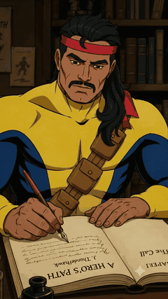
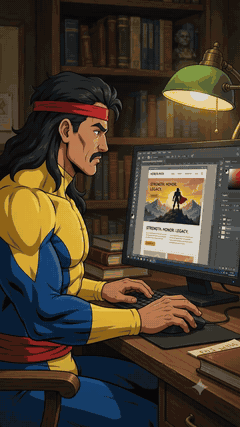
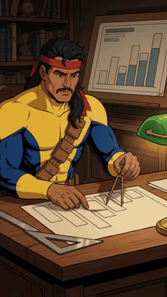
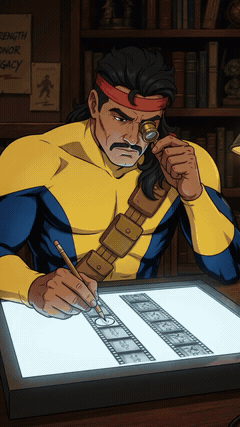

# Forge

Four Claude Code plugins for making things, and checking them.

<table align="center">
<tr>
<td align="center"></td>
<td align="center"></td>
<td align="center"></td>
<td align="center"></td>
</tr>
<tr>
<td align="center"><sub><b>story-forge</b><br>writes the book</sub></td>
<td align="center"><sub><b>design-forge</b><br>designs the site</sub></td>
<td align="center"><sub><b>deck-forge</b><br>builds the deck</sub></td>
<td align="center"><sub><b>proof-forge</b><br>checks the export</sub></td>
</tr>
</table>

<p align="center"><sub><b>Same guy.</b> He makes the thing, then he checks the thing.</sub></p>

| | |
|---|---|
| **[design-forge](design-forge/)** | Visual work — an adversarial builder/critic loop, a measurement harness, a licence-cleared asset library, a scroll-film site builder |
| **[story-forge](story-forge/)** | Long-form fiction — braindump to dossier, outlining, drafting, a three-pass line edit, a continuity audit |
| **[deck-forge](deck-forge/)** | Presentations — a component library that never builds a native chart, and a harness that measures legibility at distance and contrast against the real backdrop |
| **[proof-forge](proof-forge/)** | Exports — compare two renders and mark exactly where they differ, on video, stills or audio |

They share one idea: **judgment stays with the model, and anything expressed as a number gets measured
instead of eyeballed.**

That is not a style preference. Vision models score **58.57%** on trivial geometric tasks and
**56.84% on counting line intersections** in an image. Open-ended AI design audit runs an **80.1%
false-positive rate**, with 8.9% of it actively harmful advice. Ask a model whether a page is any good
and you get something useful. Ask it to count accents or verify a hex and you get confident noise.

So the work is split. A harness computes what is computable. The model is spent on taste, structure,
and whether the thing is actually any good.

**Why that split is worth the trouble:** a 2026 survey of 1,000 workers found **46% say fixing AI
output takes as long as doing the work manually**, and **57% say the time saving disappears once
corrections are needed**. METR's RCT is sharper still — experienced developers ran **19% slower while
believing they were 20% faster**. *AI collapses generation time and inflates verification time. The
harness decides which one wins.*

<sub>Sources and verification tiers for every figure: [design-forge/references/mechanisms.md](design-forge/references/mechanisms.md)</sub>

---

## Install

```bash
claude plugin marketplace add treynortetik-creator/forge
claude plugin install design-forge@forge     # any of them,
claude plugin install story-forge@forge      # or
claude plugin install deck-forge@forge       # or
claude plugin install proof-forge@forge      # all four
```

Or clone and install locally:

```bash
git clone https://github.com/treynortetik-creator/forge && cd forge
claude plugin marketplace add ./
claude plugin install design-forge@forge
```

Restart the session or `/clear` afterwards so the skills load.

**design-forge has an optional toolchain** (ImageMagick, Inkscape, Graphviz, ffmpeg, DuckDB) — see
`design-forge/scripts/install.sh --tools` and `design-forge/scripts/doctor.sh`, which reports what is
missing *and what each gap actually costs you*. Neither plugin requires it; both run on `python3` and
a browser.

---

## design-forge


Seven skills. The one that earns its keep is **`design-audit`** — a read-only browser harness that
computes what a screenshot cannot show.

Three pages once went through **four rounds** of the critic loop and were declared finished. The
harness then found **23 real defects in under two minutes**: a colour that was simply the wrong hex,
seventeen WCAG failures, a type-ladder violation, tap targets under the legal minimum. Then a red team
found bugs *in the harness*, and the fixed version found more still on the same "clean" pages.

Four things a screenshot structurally cannot do:

1. **Verify an exact value.** Two lavenders forty units apart look identical.
2. **Falsify a per-viewport rule.** A screenshot *is* one viewport, and you chose which one.
3. **Compare two numbers far apart in the page.** A 655px hero and a 688px story column never share a frame.
4. **Compute a ratio.** Nobody eyeballs 4.21 against 4.50.

**What it does not see, stated plainly:** one page, one state, one width. No hover or focus states (SC
2.4.7 Focus Visible is Level AA and is unchecked), no dark mode, no error or empty states, no mobile,
no RTL, no print, nothing about the accessibility tree. Two AA criteria implemented out of roughly
fifty-five. A green report means *conformant on the axes measured* — not *accessible*, and not *good*.

---

## story-forge


Seventeen skills and four chaining commands, from a braindump through to a manuscript that has been
line-edited, continuity-audited, and stripped of invisible provenance characters.

The editing half is shared with design-forge: **`de-sloppifier`** (a three-pass line edit),
**`voice`** (extract a style fingerprint from real samples so the prose is anchored to a person
instead of the model's defaults), and **`clean-export`**.

`de-sloppifier` leads with **present participial clauses**, not a word list — PNAS measured
instruction-tuned models using them at **5.3× the human rate**. The durable machine signature is
grammatical, not lexical; word lists date fast and survive light editing.

It also deliberately does **not** use the word *burstiness*. That term has three incompatible
meanings, the popular one is a mutation of a vendor coinage, and the only peer-reviewed test of it
found it unreliable. What replaced it is honest and still useful: sentence-length **CV**, where human
non-fiction runs ~78% against ~50% for machine prose **at nearly identical mean sentence length**. The
signal was never length. It was dispersion.

---


## deck-forge

A native PowerPoint chart **flattens into a static image** on Google Slides import, and there is no
workaround inside an uploaded `.pptx` — Slides only keeps a chart live when it is linked to a Sheet,
and that link cannot exist in a file you upload. The recipient cannot fix a typo in an axis label.

The usual response is a style guide telling people to avoid charts. Style guides lose. So
`deck_build.py` **has no `add_chart`**, and every visual is built from rectangles,
ovals, text boxes and tables — the primitives that survive the import editable.

⚠️ A strong default, not a sealed box: `Slide.s` and `Deck.prs` are public, so a native chart is one
attribute hop away. An earlier draft of this README claimed compliance was "structural"; a review
disproved it in one line. What the round trip guarantees is narrower and still useful — **the library
never creates a chart, and the audit catches one if you reach around it.** The builder also enforces the legibility floor with an exception rather than
a warning, on the theory that a warning you can scroll past is how 8pt footnotes ship.

`deck_audit.py` measures what a person looking at a slide cannot:

| | |
|---|---|
| **legibility** | minimum point size from the ANSI/INFOCOMM V202.01 element-height model |
| **contrast** | WCAG 1.4.3 against the **actual** backdrop, resolved by z-order |
| **native charts** | the thing that will silently become a picture |
| **off-slide geometry** | including shapes nested inside groups |

Two results worth stating plainly. **Points are not a physical size** — a point is a document unit,
and treating it as an inch gives a 185pt floor for a 30ft room. And **WCAG large text is 18pt or 14pt
bold** — the familiar 24px/18.66px figures are those same sizes in CSS pixels, so applying them to
points invents failures between 18 and 24pt.

⚠️ **On provenance, stated plainly:** the `/200` acuity factor is straight out of ANSI/INFOCOMM
V202.01 §4.3.1. The 4/6/8 rule is **not** — it appears zero times in the standard, and AVIXA's own
training deck titles it *"The Old Way of Doing Things"* with *"Origins are unclear."* The arithmetic
is sound; the provenance is folklore. An earlier draft of this README claimed the opposite, and also
claimed the resulting number explains where the folk "24pt minimum" came from. Nothing supports that,
and the claim is withdrawn.

The harness shipped four times reporting green on the defect it exists to catch, including a version
that returned "0 runs, all PASS, exit 0" on a deck built exactly the way the plugin says to build one.
Each of those is now a regression test.

---


## proof-forge

The single strongest request in a dig through practitioner forums, verbatim:

> *"I need to compare two exports and make sure they are exact visual replicas... the only way I know
> how is to drop a video file into the top layer and compare it one clip at a time. This is incredibly
> tedious and isn't even foolproof. **Sometimes the difference is just one little corner of the frame
> for one second in a two-hour sequence.**"*

And the spec for the fix, from the same person: *"even if there was a tool that just did the
difference-mode scanning for you and **added markers where the differences appeared**, that would be a
big step."* The commercial equivalent starts in the mid five figures.

**The hard part is the threshold, not the diff.** Two exports of the same timeline are never
bit-identical — a different encoder, bitrate or colour pipeline moves every pixel slightly. An
absolute threshold therefore flags either the whole file or none of it, depending on codec, and a
tool that cries wolf on a routine re-encode is one people stop running.

So the threshold is derived **from the pair being compared**: take the median per-frame PSNR as that
pair's own encoding-noise floor and flag frames that fall well below it. Verified in both directions —
CRF 18 against CRF 32, and against an entirely different codec, produce **zero** markers; a 70×70 box
for one second in a 640×360 frame produces exactly **one**, in the right second, with an EDL you can
import.

Stills get a bounding box and a per-tile heat map. Audio gets a phase-invert null test, which is exact
rather than statistical: identical audio cancels to digital silence, and a 0.1% gain change surfaces
at −78 dBFS.

31 tests, fixtures generated with ffmpeg at run time.

---

## Attribution

Both plugins stand on other people's work and say so.

- **design-loop** is adapted from *The Design Loop*, itself a variation on the **Gauntlet Loop
  originated by Matt Shumer**. The method is his.
- **story-forge's craft notes** summarise publicly posted material, largely **Jason Hamilton / The
  Nerdy Novelist**, plus **Wulf Moon**'s framework and **Browne & King's *Self-Editing for Fiction
  Writers***. Each note names its source in frontmatter. Full detail: **[story-forge/NOTICES.md](story-forge/NOTICES.md)**.
- 🔴 **The de-sloppifier's AI-vocabulary lists overlap Wikipedia's *Signs of AI writing*, which is
  CC BY-SA** — attribution and share-alike required. Credited in both plugins' notices. If you reuse
  those lists, carry the attribution.
- **Two notes were deliberately removed before this went public** because they are third-party
  creative assets rather than summaries of a method — a verbatim prompt and a curated vocabulary list.
  Nothing is broken by their absence; see
  [story-forge/references/writing/README.md](story-forge/references/writing/README.md).
- **Anthropic's `frontend-design` skill** is quoted in design-forge's house-style notes, marked inline.
- The **asset library** ships 61 files under MIT, ISC, OFL-1.1, CC0 and public-domain terms, each with
  its licence *and where that licence was verified* recorded per file. See
  [design-forge/THIRD-PARTY-NOTICES.md](design-forge/THIRD-PARTY-NOTICES.md).

If you are one of the creators above and want something changed or removed, open an issue and it goes
the same day.

---

## Licence

MIT for the original work in this repository. The bundled assets under
`design-forge/skills/art-department/library/` remain under their own licences, which carry
redistribution obligations of their own — those are enumerated in
[design-forge/THIRD-PARTY-NOTICES.md](design-forge/THIRD-PARTY-NOTICES.md).
